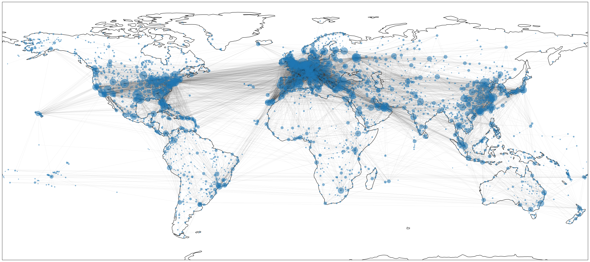

# Epidemic spread over the flights network
## Abstract
Pandemics are known to spread rapidly over the world if no measures are taken to control the spreading. In this final report, we analyze the flight network through centrality measures to detect nodes of interest. With the help of a spreading simulator, we then analyze the behavior of said nodes in a pandemic setting. To assess the behavior of the network without the node of interest, we ran the simulation without these nodes. Overall, our results show that the removal of nodes of interest is an effective strategy to reduce the spread of a pandemic. By targeting the most connected parts of the network, we can significantly reduce the reproduction rate of the disease and limit its spread.

[Read the full report here](Final_NS__Model___Report.pdf)

